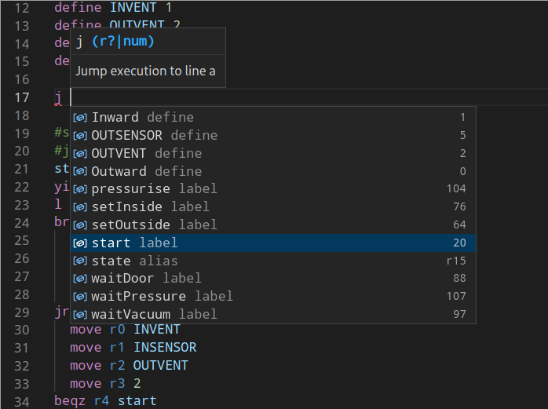

# IC10 Language Support for Stationeers

This Visual Studio Code extension provides syntax highlighting, IntelliSense, and other language support features for the IC10 MIPS-like language used in the game Stationeers.

## Features

- Syntax highlighting for IC10 language files (`.ic10`)
- Code autocompletion
- Hover information
- Signature help
- Go to definition
- Diagnostics

## Installation

1. Open Visual Studio Code.
2. Press `Ctrl+P` to open the Quick Open dialog.
3. Type `ext install ic10-language-support` and press `Enter`.
4. Once the extension is installed, you can start using it by opening `.ic10` files.

## Usage

After installing the extension, you can use it by opening any `.ic10` file in Visual Studio Code. The extension will automatically activate and provide syntax highlighting and language features for your IC10 MIPS-like code.

## Contributing

If you find any issues or have suggestions for improvements, please [open an issue on GitHub](https://github.com/awilliamson/ic10-language-support/issues).

## License

This extension is released under the [MIT License](https://opensource.org/licenses/MIT). See the [LICENSE](https://github.com/awilliamson/ic10-language-support/blob/master/LICENSE) file for more information.